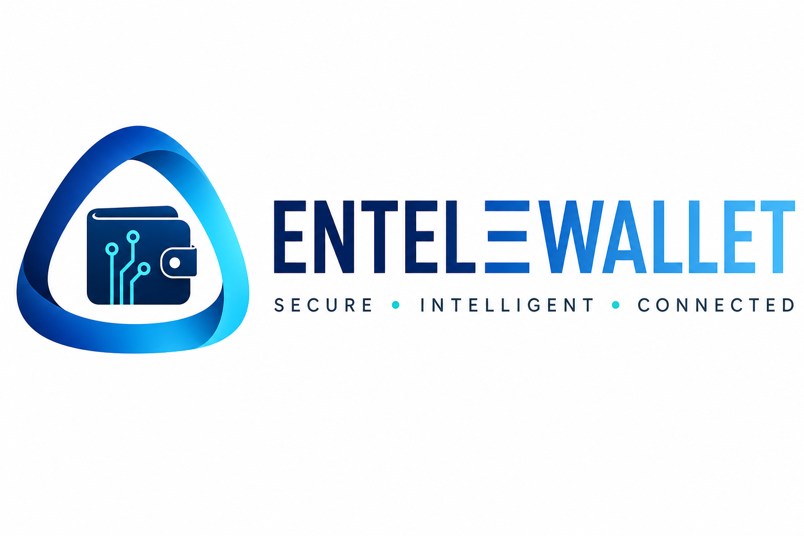
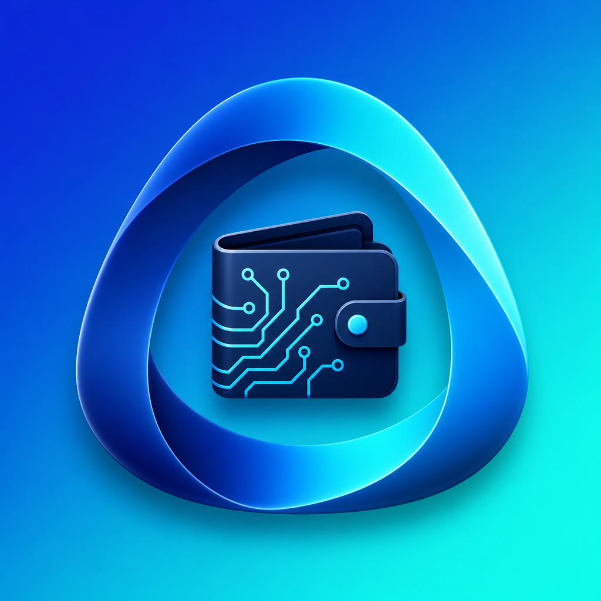

# EnteleWALLET

<p align="center">
  
</p>

<p align="center">
  <strong>EnteleWALLET Lite</strong> — Secure wallet-connected dashboard for the EnteleKRON ecosystem.
</p>

<p align="center">
  
</p>

Repository: [tvk-group/entelewallet](https://github.com/tvk-group/entelewallet)

## Brand Assets

Official logos and banners live in:

| Asset | Path |
|-------|------|
| Horizontal logo | `.github/assets/entelewallet-logo-horizontal.png` |
| App icon (512) | `.github/assets/entelewallet-icon-512.png` |
| Social preview / OG | `.github/assets/social-preview.png` |
| Website copies | `apps/web/public/brand/` and `apps/web/public/og/` |

Tagline: **SECURE • INTELLIGENT • CONNECTED**

## Current Phase

**EnteleWALLET Lite** — Phase 1 production release.

Connect, verify and monitor your EnteleKRON ecosystem wallet. Read-only, non-custodial, no seed phrases or private keys.

## What It Does

- Connect existing wallets via RainbowKit modal (MetaMask, WalletConnect, Coinbase, etc.)
- Verify wallet ownership with SIWE (EIP-4361) signatures
- View ENK, ETH, USDT, SOVRA, ENM asset balances
- Access transaction explorer links
- View vesting and claim readiness status
- Official address / transparency integration
- Security center with phishing protection guidance
- 25-language multilingual support

## What It Does NOT Do

- Create or import wallets
- Store seed phrases or private keys
- Custody funds
- Send tokens, swap, stake, or trade
- Browser extension or mobile key storage

> **Warning:** This repository must never add seed phrase, private key, custody, transfer, swap or exchange functionality without formal security architecture, independent audit planning and legal approval.

## Domains

| Domain | Purpose |
|--------|---------|
| app.entelewallet.com | Canonical app (this repo) |
| entelewallet.com | Marketing site (separate repo) |
| entelewallet.app | Redirect → app.entelewallet.com |
| wallet.entelekron.io | Redirect → app.entelewallet.com |

## Setup

```bash
pnpm install
cp .env.example apps/web/.env.local
pnpm dev
```

Open [http://localhost:3000](http://localhost:3000).

## Environment Variables

See [docs/ENVIRONMENT.md](./docs/ENVIRONMENT.md) and `.env.example`.

Key variables:
- `NEXT_PUBLIC_WALLETCONNECT_PROJECT_ID` — WalletConnect Cloud project ID
- `NEXT_PUBLIC_ETHEREUM_RPC_URL` — Ethereum RPC (optional)
- Supabase credentials — for production auth storage

## Scripts

| Script | Description |
|--------|-------------|
| `pnpm dev` | Start development server |
| `pnpm build` | Production build |
| `pnpm lint` | ESLint |
| `pnpm typecheck` | TypeScript check |
| `pnpm i18n:check` | Validate all translations |
| `pnpm security:check` | Verify dangerous flags disabled |
| `pnpm format` | Prettier format |

## Project Structure

```
apps/web/           Next.js application
packages/config/    Feature flags, tokens, chains, domains
packages/wallet-core/  SIWE verification (no private keys)
packages/security/  Security copy and constants
packages/blockchain/  Explorer links, ERC-20, multicall
packages/i18n/      25-language translations
packages/ui/        Shared UI components
docs/               Architecture, security, deployment docs
supabase/           Database migrations
```

## Security

- SIWE signatures verify ownership only — no gas, no transactions
- Dangerous feature flags disabled by default
- Official domain list: app.entelewallet.com, entelewallet.com, entelekron.io, tvk.group
- See [docs/SECURITY_MODEL.md](./docs/SECURITY_MODEL.md)

## Roadmap

See [docs/PHASES.md](./docs/PHASES.md).

- **Now:** Lite — connect, verify, monitor
- **Next:** Account layer, investor linking, vesting integration
- **Future:** Full non-custodial wallet (requires audit + legal review)

## License

Proprietary — TVK Group. All rights reserved.
